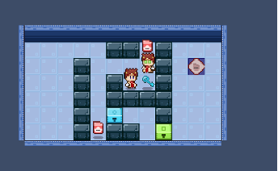
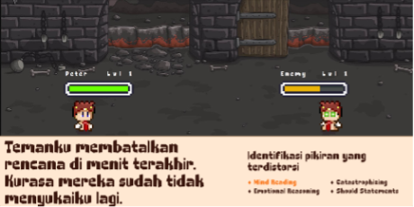

## Short Explaination

Cognivirues Outbreak is a web-based AI-powered RPG game that gamifies Cognitive Behavioral Therapy, empowering users to identify and manage cognitive distortions – negative and inaccurate thought patterns through a fun and addictive gameplay

## Project Goals

Permainan ini dirancang khusus untuk player yang pernah mengalami gejala gangguan depresi. Permainan ini mengintegrasikan teknik-teknik terapi Kognitif Perilaku (CBT) sesuai dengan rancangan intervensi yang telah dirumuskan. Tujuannya adalah untuk membantu pemain mengatasi gejala depresi melalui pengalaman bermain yang interaktif dan edukatif.

## Tech Stack Used

Cognivirues Outbreak project uses a range of technologies, including: React.js, HTML5 Canvas, Typescript, Node.js, Express.js, PostgreSQL and Docker

## Features

- Mengembangkan sebuah permainan RPG yang dapat melatih keterampilan kognitif untuk mengatasi pikiran negatif dan meningkatkan kesejahteraan emosional.
- Meningkatkan keterampilan kognitif untuk mengatasi pikiran negatif dan meningkatkan kesejahteraan emosional.
- Membangun kebiasaan melakukan exercise terapi melalui sistem gamifikasi

## Demo

<iframe width="100%" height="400" src="https://www.youtube.com/embed/mActGub0Bok" frameborder="0" allow="accelerometer; autoplay; clipboard-write; encrypted-media; gyroscope; picture-in-picture" allowfullscreen></iframe>

Genu cupiens quoque: cum dolor: sollicitive cantu, et piae Leuconoe, huius non
nil tuli Peleusque rauca. Et alvum cuncti Hippodamas meritis nec coniunx ausa,
pete. Congestaque nisi nullus poena. Tanto cum, curvis vulnera quod optatis,
trahens conplexa saepe.

Hominum quo. Signa germanaeque iuvat at feruntur precantibus corpus praebuerat
excipit mixtaeque inferior, haec percepit regum: nec nec sit ferenti.

## The Problems and How I Deal With It

Genu cupiens quoque: cum dolor: sollicitive cantu, et piae Leuconoe, huius non
nil tuli Peleusque rauca. Et alvum cuncti Hippodamas meritis nec coniunx ausa,
pete. Congestaque nisi nullus poena. Tanto cum, curvis vulnera quod optatis,
trahens conplexa saepe.

Hominum quo. Signa germanaeque iuvat at feruntur precantibus corpus praebuerat
excipit mixtaeque inferior, haec percepit regum: nec nec sit ferenti.

## Lesson Learned

Genu cupiens quoque: cum dolor: sollicitive cantu, et piae Leuconoe, huius non
nil tuli Peleusque rauca. Et alvum cuncti Hippodamas meritis nec coniunx ausa,
pete. Congestaque nisi nullus poena. Tanto cum, curvis vulnera quod optatis,
trahens conplexa saepe.

Hominum quo. Signa germanaeque iuvat at feruntur precantibus corpus praebuerat
excipit mixtaeque inferior, haec percepit regum: nec nec sit ferenti.
